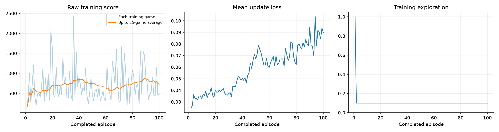
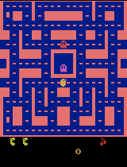
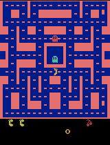

# Ms. Pac-Man DQN — Class 3 Submission

Training a Deep Q-Network (DQN) to play **Ms. Pac-Man** (`ALE/MsPacman-v5`) using the ready-made
notebook. I chose three hyperparameters, ran one full training + evaluation experiment, and report
the actual results below.

## How to open and run

- **Notebook:** [`pacman_dqn.ipynb`](pacman_dqn.ipynb) — open it and choose a Python 3.11–3.13 kernel.
- **Google Colab:** open the notebook, select `Runtime → Change runtime type → GPU` if available, edit the
  three values in **section 1**, then `Runtime → Run all`.
- **Local (VS Code / Jupyter):** clone this repo, open the notebook, select your Python kernel, edit the
  three values in section 1, and **Run All**. CUDA / Apple Silicon MPS / CPU are detected automatically.

The notebook installs its own packages and detects the device on first run.

## My three hyperparameters

| Setting | Value | Default | Why I chose it |
|---|---|---|---|
| **Exploration** | `0.10` | 0.20 | Exploration is held *constant* after the 1,000-decision warm-up, so with a short 100-episode budget I lowered it below the default to spend fewer training moves on random actions and let the agent act on what it was learning. Warm-up already provides initial random coverage. |
| **Episodes** | `100` | 100 | Kept the notebook's default budget — a full run I could complete in about nine minutes on my hardware while still giving the agent enough games to show measurable learning. |
| **Learning rate** | `0.00025` | 0.0001 | The classic Nature-DQN learning rate. Larger than the default reference so each update makes more progress, which matters when the training budget is small. It stayed stable (no diverging loss). |

All other hyperparameters were left at the notebook's defaults, and the evaluation settings (same five
seeds, 5% exploration, same time limit before and after) were **not** changed.

## What I expected vs. what I observed

**Expected:** With only 100 episodes and the deliberately small 5,000-transition replay buffer, I expected
at most a modest improvement over the untrained baseline — Atari agents normally need far more experience.

**Observed:** The agent improved clearly. The **trained mean rose from 492 to 868 (+76%)**, beating the
untrained baseline on **4 of the 5 evaluation seeds**. The periodic single-seed demos also trended upward
(300 → 320 → 1000 → 1210), suggesting real policy improvement rather than noise — though seed 505 got
*worse* (490 → 430), so improvement was not universal.

## Actual training budget and hardware

| Metric | Value |
|---|---|
| Completed episodes | **100** (not interrupted) |
| Total decisions | **60,743** |
| Learning updates | **14,936** |
| Elapsed time | **547.3 s (≈ 9 min 7 s)** |
| Device | **Apple Silicon MPS** |
| Environment | Python 3.11.2 · PyTorch 2.14.0 · Gymnasium 1.3.0 · ALE-py 0.11.2 · macOS arm64 |

Source: [`results/training_summary.json`](results/training_summary.json) and
[`results/config.json`](results/config.json).

## How the learning works (plain language)

- **Observations:** the agent sees the game as **four stacked 84×84 grayscale screens** — four recent
  frames so it can perceive motion (which way ghosts and Ms. Pac-Man are moving).
- **Actions:** the **joystick moves** — the discrete Atari directions the agent can choose each step.
- **Reward:** the **game points** earned (pellets, power pellets, eating ghosts). The network learns to
  pick actions that lead to more points over time (discounted by gamma = 0.99).

Under the hood it's a convolutional Q-network trained with experience replay, a target network, Adam, and
Huber loss. Training rewards are clipped to [-1, 1]; all **reported scores are raw** game points.

## Results

### Before / after evaluation (same five seeds, 5% exploration)

| Seed | Baseline (untrained) | Trained | Change |
|---|---|---|---|
| 101 | 350 | 1210 | +860 |
| 202 | 500 | 700 | +200 |
| 303 | 320 | 720 | +400 |
| 404 | 800 | 1280 | +480 |
| 505 | 490 | 430 | −60 |
| **Mean** | **492.0** | **868.0** | **+376 (+76%)** |

Full data: [`results/comparison.json`](results/comparison.json) ·
baseline detail: [`results/baseline.json`](results/baseline.json).

### Training dashboard (score, loss, exploration)

Full per-episode history: [`results/training.csv`](results/training.csv).

### Gameplay

**Untrained (baseline):**

**Best trained game:**

**Progress every 25 episodes** (periodic demo scores on seed 101: 300 → 320 → 1000 → 1210 —
see [`results/demo_scores.json`](results/demo_scores.json)):

| Episode 25 | Episode 50 | Episode 75 | Episode 100 |
|---|---|---|---|
|  |  |  |  |

## One limitation and one next experiment

**Limitation:** The result is high-variance and under-trained. Individual evaluation games ranged from
430 to 1280, one seed regressed, and 100 episodes / ~15k learning updates is tiny for Atari. The small
5,000-transition replay buffer means the agent learns from only a narrow, recent slice of experience, so
the improvement may not generalize.

**Next experiment:** I would change **one setting — episodes — raising it to ~500**. It's the single
biggest lever: more games give the replay buffer more diverse experience and the network many more updates
to stabilize the policy, which should lift the mean score and shrink the seed-to-seed variance. (A close
runner-up would be enlarging `replay_capacity`.)

## Files in this submission

- [`pacman_dqn.ipynb`](pacman_dqn.ipynb) — executed notebook with all outputs visible (this run).
- [`results/`](results/) — curated evidence: GIFs, `training_dashboard.png`, `comparison.json`,
  `baseline.json`, `demo_scores.json`, `config.json`, `training.csv`, `training_summary.json`.
- Large model checkpoints (`*.pt`) are **not** committed; they are kept locally in the run folder under
  `pacman_runs/` (and can be attached to a GitHub release if needed).
